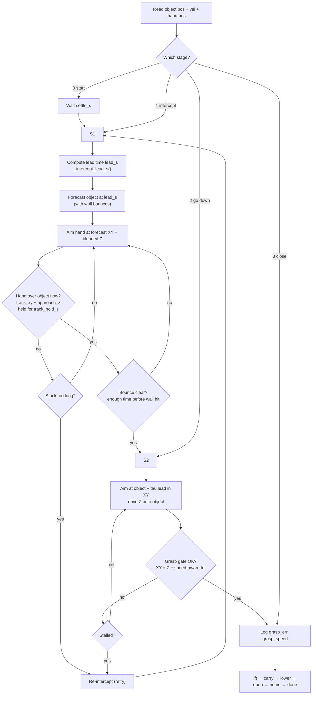
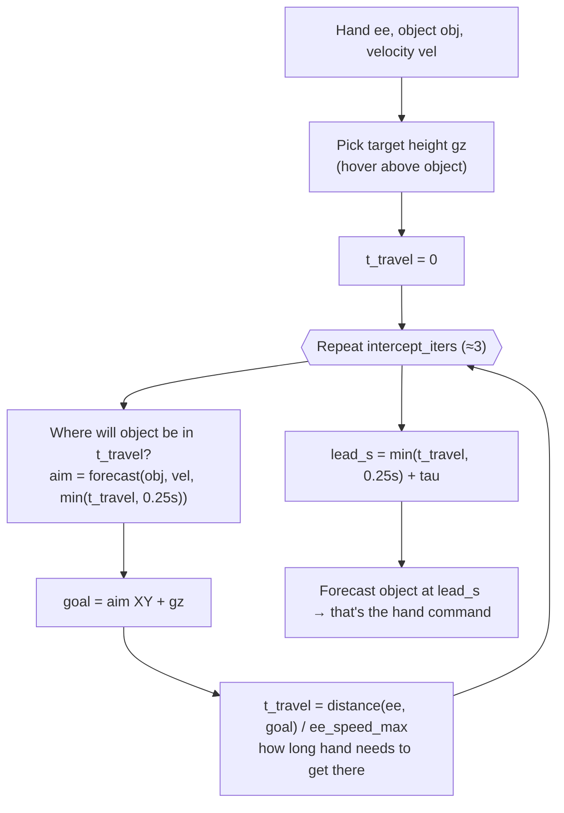
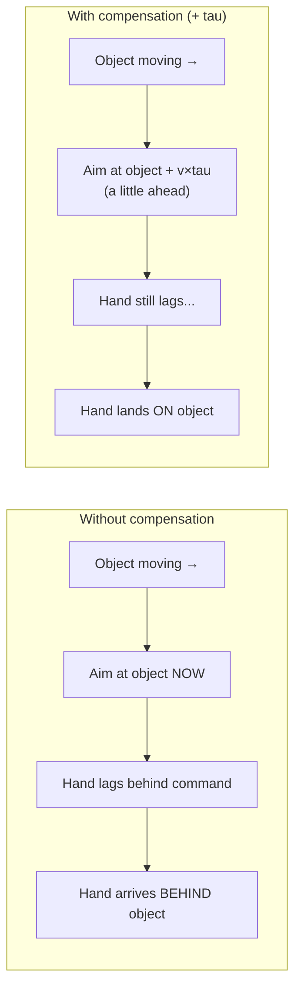
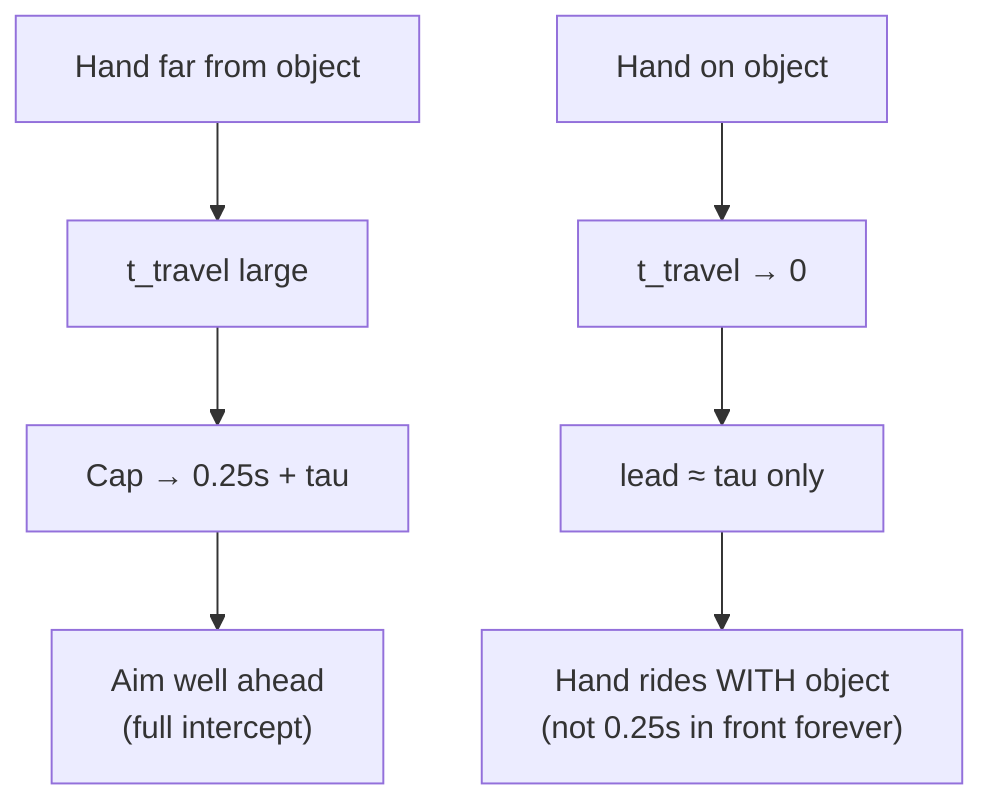

# Intercept-servo flow diagrams

Plain guide to how the expert chases a moving object. Code: [`sim/state_machine.py`](../sim/state_machine.py).

---

## One sim step (stages 0–9)

---

## Inside `_intercept_lead_s` (meet-up solver)

Code: [`state_machine.py` lines 230–256](../sim/state_machine.py#L230).

---

## What `tau` does (lag compensation)

`tau` ≈ `servo_lag_s + dt` — arm delay from command to motion. We aim **ahead** so lateness puts the hand **on** the object, not behind it. The object speed is **not** slowed down.

---

## Far vs close (why lead shrinks)

---

## Legend

| Term | Plain meaning |
|------|----------------|
| **forecast** | Roll object forward in time (same bounce rules as sim) |
| **lead_s** | How many seconds ahead we look when aiming |
| **tau** | Arm delay — command arrives before motion catches up |
| **track gate** | Is hand over object *now*? (not over a moving aim point) |
| **bounce guard** | Don't go down if object will hit a wall before grasp finishes |

---

## Related docs

- **`step()` function (all stages):** [`step-function-flow.md`](step-function-flow.md)
- Full stage walkthrough: [`sim/STATE_MACHINE.md`](../sim/STATE_MACHINE.md)
- Knobs: [`sim/phase0_cfg.yaml`](../sim/phase0_cfg.yaml) → `state_machine_params`
