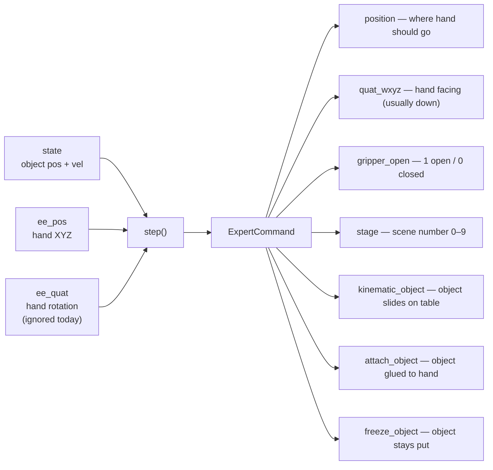
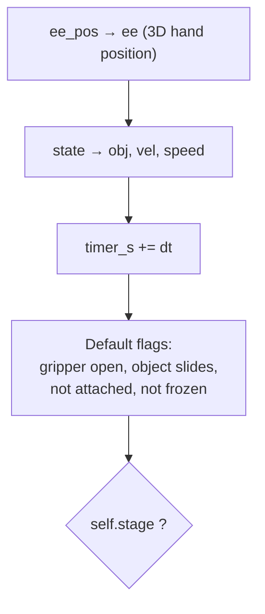
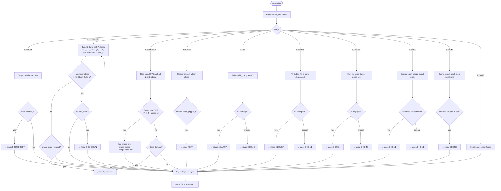
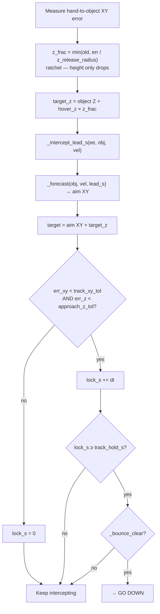
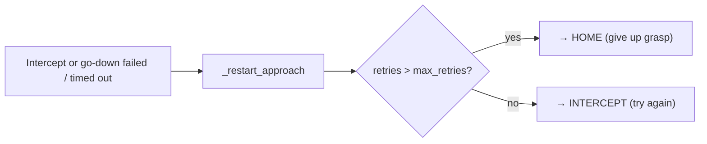

# `PickPlaceStateMachine.step()` flow

Code: [`sim/state_machine.py` lines 364–574](../sim/state_machine.py#L364).

Called once per sim tick from [`collect.run_episode`](../sim/collect.py#L188).

---

## What goes in / what comes out



**Plain words:** read object + hand → pick next hand target and object mode → scene executes it.

---

## Top of every `step()` call



`ee_quat` is passed in for logging / future use but **not used** in decisions (`del ee_quat`).

---

## All stages (main flow)



---

## Stage 1 INTERCEPT (detail)



---

## Stage 2 GO DOWN (detail)

```mermaid
flowchart TD
    A["aim = forecast(obj, vel, tau)<br/>lag-only lead in XY"] --> B["target XY = aim, target Z = object Z"]
    B --> C{err_xy < grasp_tol_xy(speed)<br/>AND err_z < grasp_z_tol?}
    C -->|yes| D["Save grasp_err_xy, grasp_err_z, grasp_speed<br/>→ CLOSE"]
    C -->|no| E{stage_timeout?}
    E -->|yes| F["_restart_approach"]
    E -->|no| G[Keep descending]
```

---

## Object + gripper flags by stage

| Stage | gripper | object slide | attach | freeze |
|------:|:-------:|:------------:|:------:|:------:|
| 0–2 intercept / go down | open | yes | no | no |
| 3 close | **closed** | no | **yes** | no |
| 4–6 lift / carry / lower | closed | no | yes | no |
| 7 open | open | no | no | **yes** |
| 8–9 home / done | open | no | no | yes |

---

## Retry path



---

## Related docs

- Intercept + tau diagrams: [`intercept-servo-flow.md`](intercept-servo-flow.md)
- Full stage guide: [`sim/STATE_MACHINE.md`](../sim/STATE_MACHINE.md)
